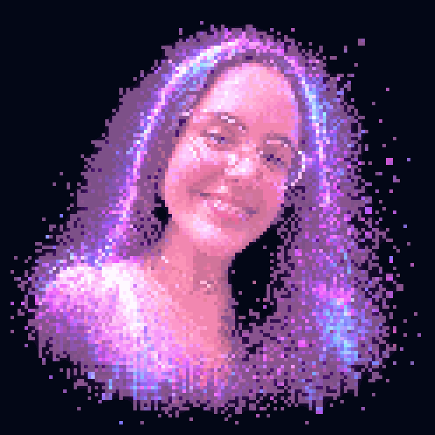

<div align="center">


<a href="https://git.io/typing-svg">
  
</a>

<br><br>

<a href="https://github.com/biancaiolanda"></a>
<a href="https://instagram.com/bianca.iolanda_"></a>
<a href="https://www.tiktok.com/@bianca.iolanda_"></a>
<a href="https://www.youtube.com/@bianca.iolanda"></a>

</div>

---

## `> visual_map.exe`

<table>
  <tr>
    <td width="48%" align="center">
      
    </td>
    <td width="52%" valign="top">
      <br>
      <h3>⚡ SYSTEM.INFO</h3>
      <code>Subject</code> Bianca Iolanda<br><br>
      <code>Role</code> Desenvolvedora Backend Junior<br><br>
      <code>Origin</code> Brasil 🇧🇷<br><br>
      <code>Status</code> Construindo e evoluindo<br><br>
      <code>Core.Lang</code> C# • JavaScript<br><br>
      <code>Core.Backend</code> .NET • ASP.NET<br><br>
      <code>Core.Data</code> MySQL • PostgreSQL<br><br>
      <code>Core.Infra</code> Docker • AWS • Git<br><br>
      <code>Mission</code> Ideias → sistemas sustentáveis
      <br><br>
      
    </td>
  </tr>
</table>

## `> whoami`

```csharp
public class BiancaIolanda
{
    public string Role     => "Desenvolvedora Backend Junior";
    public string Location => "Brasil 🇧🇷";

    public string[] Focus =>
    {
        "Sistemas inteligentes",
        "Plataformas SaaS",
        "APIs e integrações com ERP",
        "Aplicações web escaláveis",
        "Performance e código limpo"
    };

    public string Mission =>
        "Transformar problemas reais de negócio em software sustentável.";
}
```

## `> system_capabilities`

<table>
  <tr>
    <td width="50%" valign="top">
      <h3>🏗️ Engenharia</h3>
      • SaaS e sistemas escaláveis<br>
      • Arquitetura e modelagem<br>
      • Performance e eficiência<br>
      • Organização e código limpo
    </td>
    <td width="50%" valign="top">
      <h3>⚙️ Backend & Negócio</h3>
      • APIs seguras e autenticação<br>
      • Regras de negócio<br>
      • Integrações com APIs e ERP<br>
      • Dashboards, relatórios e dados
    </td>
  </tr>
</table>

## `> tech_stack --all`

<div align="center">

### Backend & Dados


### Frontend


### DevOps & Ferramentas


<br><br>


</div>

## `> github_analytics`

<div align="center">
  
  
  <br>
  
</div>

## `> contribution_snake --watch`

<div align="center">
  <picture>
    <source media="(prefers-color-scheme: dark)" srcset="https://raw.githubusercontent.com/biancaiolanda/biancaiolanda/output/github-contribution-grid-snake-dark.svg" />
    <source media="(prefers-color-scheme: light)" srcset="https://raw.githubusercontent.com/biancaiolanda/biancaiolanda/output/github-contribution-grid-snake.svg" />
    
  </picture>
</div>

## `> activity_graph`

<div align="center">
  
</div>

## `> profile_summary`

<div align="center">
  
</div>

---

<div align="center">

### 💭 Vamos construir algo incrível?

Estou sempre aberta a **colaborações, parcerias e ideias inovadoras**.

> _“O importante é não parar de questionar.” — Albert Einstein_


</div>
